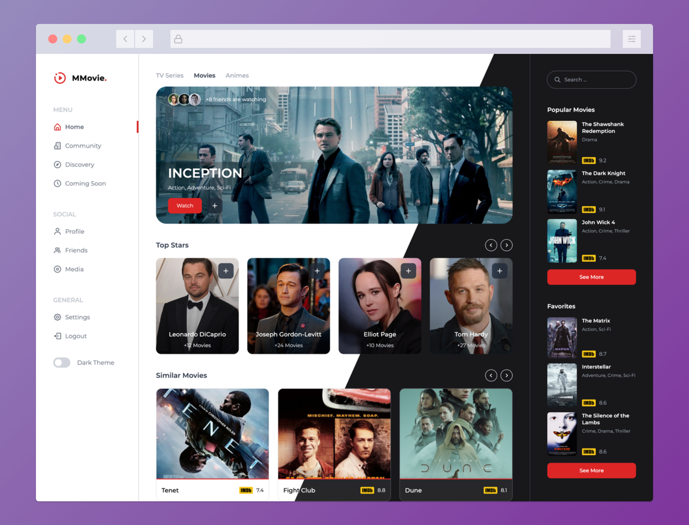

# Tailwindcss Movie Dashboard Template

A responsive movie dashboard template designed with tailwindcss.
The dashboard is designed in light and dark theme.
In order to change theme between light and dark,a switch toggler is put on the menu.
Alpinejs v3 script is used to make theme toggler dynamic.


## Screenshots




## Installation & Development

For furthur development, Tailwindcss and Node.js dependencies need to be installed by npm.

```bash
  npm install 
```

In development, Tailwind CLI will be needed to watch and build the style.css

```bash
  npm run build 
```
